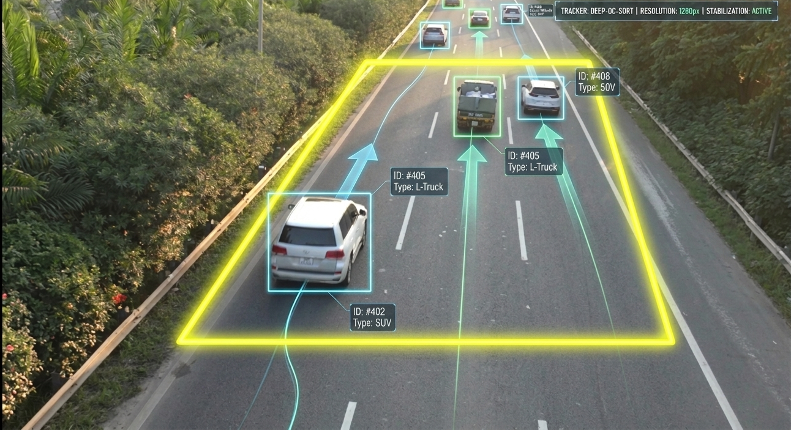
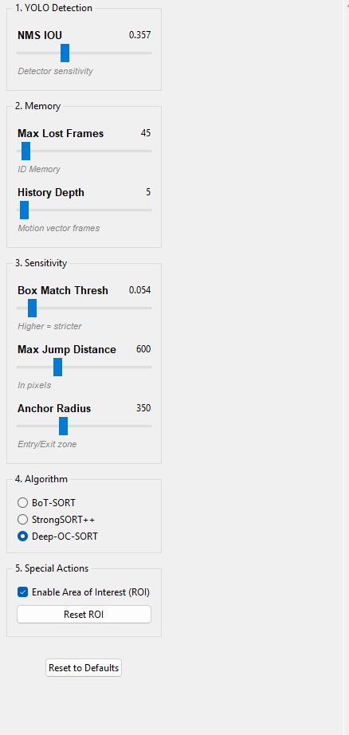

#  High-Speed Highway AI Tracker

This is a professional-grade vehicle tracking and ID stabilization pipeline specifically optimized for **high-speed, high-density traffic monitoring**. Using a combination of YOLOv8 detection and the advanced Deep-OC-SORT tracking algorithm,  maintains rock-solid vehicle identities even at highway speeds.




## 🚀 Key Features

*   **Highway Optimized Detection**: Configured for 1280px resolution to detect small, distant vehicles entering the horizon.
*   **3-Tier ID Stabilization**: A custom logic layer that prevents ID-switches using spatial anchors and trajectory-based physics predictions.
*   **Anti-ID-Merging**: Specially tuned for dense traffic to prevent different cars from stealing the same identity.
*   **Live Parameter Tuning**: A real-time control panel (GUI) allows you to adjust AI sensitivity, search distance, and memory depth while the video is running.
*   **4-Point ROI (Area of Interest)**: Define your own monitoring zone with a custom polygon mask to ignore irrelevant background movement.
*   **Smart State Management**: Your ROI and tuning parameters are automatically saved and preserved across runs.

---

## 🛠️ Project Structure

*   `main_track.py`: The primary engine. Handles video processing, ROI selection, and the ID Stabilization logic.
*   `setting.py`: The Live Tuning GUI (Control Panel) for real-time parameter adjustment.
*   `config.py`: Centralized configuration and hardware settings.
*   `settings.json`: Persistent storage for your ROI and tracking parameters.

---

## 🏗️ Architecture & Performance

To ensure maximum stability and speed, the system uses a **Decoupled Multiprocess Architecture**:

*   **Multiprocessing**: The AI Tracking Engine and the Live Tuning Control Panel run as **separate system processes**. This prevent the GUI from freezing during heavy AI workloads and ensures that ID stabilization remains perfectly sequential.
*   **Sequential Reliability**: The core tracking loop is purposely kept sequential to maintain the integrity of the **History Depth** and **Trajectory Vectors**. Splitting the video stream into parallel chunks would break ID continuity, so  prioritizes "Timeline Integrity."
*   **GPU Acceleration**: Full support for NVIDIA CUDA (configured in `config.py`) to handle high-resolution processing at high FPS.

---

## 📋 Installation

1. **Python Environment**: Ensure you are using Python 3.10+.
2. **Dependencies**:
   ```bash
   pip install ultralytics opencv-python boxmot numpy
   ```
3. **Weight Files**: Ensure your YOLO models are in the `models/` folder and tracking YAMLs (like `deepocsort.yaml`) are in the root directory.

---

## 🚦 How to Use

### 1. Start the System
Run the main script:
```bash
python main_track.py
```
This will automatically launch the tracking window and the **Live Tuning** control panel.

### 2. Define your ROI
On the first run, a window will appear. Click **4 points** on the frame to define your road monitoring zone. 
*   **Enter**: Confirm the zone.
*   **'c'**: Clear points.
*   **'r'**: Reset the ROI later during a run.

### 3. Live Tuning
Use the Control Panel sliders to adjust performance:
*   **Max Jump Distance**: Set higher (1000+) for very fast cars, lower (500-600) for dense traffic to avoid ID swaps.
*   **Max Lost Frames**: Determines how long the AI "remembers" a car once it disappears.
*   **Track Algorithm**: Toggle between **Deep-OC-SORT** (High Accuracy) and **BoT-SORT** (Balance).

## 🖥️ Monitoring Dashboard

The video window includes a real-time tracking dashboard to help you verify AI performance:

*   **Active IDs (Green)**: Vehicles currently visible on the road and actively being tracked.
*   **Memory / Hidden (Orange)**: Vehicles that have disappeared (occluded by trucks or out of frame) but are still being "remembered" by the AI.
*   **Memory Clock Sync**: The system continuously ages hidden IDs every frame. Even if the road is empty, the "Missing Frame" counter keeps ticking, ensuring that IDs expire correctly according to your `Max Lost` settings.

---

## 🧠 Understanding Core Parameters

To achieve the best tracking results on different roads, it is important to understand these two settings:

### 1. Max Lost Frames (The "Patience" Timer)
This tells the AI how long to "wait" for a vehicle after it is hidden by a truck, sign, or shadow.
*   **High Value (100+):** Better for sparse traffic where cars might be hidden for a long time.
*   **Low Value (30-50):** Better for dense highway traffic to prevent a new car entering the frame from "stealing" an old ID.

### 2. History Depth (The "Accuracy" Buffer)
This determines how many previous frames the AI uses to calculate a vehicle's **Speed and Direction**.
*   **High Value (40+):** Creates a very steady, accurate trajectory. Best for straight highways.
*   **Low Value (10-15):** More responsive to sudden turns or lane changes.

---

## 🔍 Understanding the Console (ID Processing)

The system provides real-time logs of its "thought process":

*   `[IDStabilizer] New Object`: A new car has been uniquely identified.
*   `[IDStabilizer] Match Found via trajectory`: The car was recovered using speed/direction math after an occlusion.
*   `[IDStabilizer] Expiring Stable #ID`: A car left the screen and its ID was safely released to keep memory clean.

---

## ⚙️ Recommended Highway Settings

| Setting | Value | Why? |
| :--- | :--- | :--- |
| **YOLO_IMGSZ** | 1280 | High resolution for small distant cars. |
| **STABILIZER_DIST**| 600 | Tight search radius for dense traffic. |
| **TRACK_BUFFER** | 8000 | Long-term memory for traffic flow. |
| **STABILIZER_IOU** | 0.2 | Strict matching for high accuracy. |

---

## ⚠️ Important Notes
*   **Class Filtering**: Currently configured to track **Cars (2), Buses (5), and Trucks (7)** to reduce noise from background objects.
*   **GPU Usage**: The 1280px resolution requires a modern GPU for real-time performance.

Developed for high-precision traffic analytics and surveillance.
